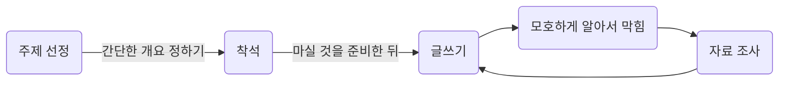

## 개요
얼마 전 글쓰는 개발자 커뮤니티인 글또에서 글쓰기 세미나가 있었습니다. 개발블로그를 하고 있긴 한데 글쓰기 결과물이 부족한 것 같고, 글쓰는 시간이 너무 오래 걸리는 것 같아서 참여했는데, 스스로가 처한 환경을 프로그래밍(?)해서 글쓰기 과정을 개선하나간 경험과 팁, 퇴고와 피드백의 중요성을 다시 깨닫게 된 좋은 시간이었습니다.
그리고 자신의 글쓰기 프로세스를 분석하고, 기존에 작성한 하나를 수정한 뒤 소감을 남기는 과제를 받았습니다. 이 글은 해당 과제입니다. 이 글은 같이 과제를 하실/하신 글또 분들이 주로 읽게 되겠네요. 
### 기존 글쓰기 프로세스

### 자세한 프로세스

1. 주제 정하기
    1. 대략적인 주제를 정합니다. 따로 주제를 모아 정리해둘 때도 있고, 머릿속에 담아둘 때도 있습니다.
    2. 전체적인 개요를 작성합니다. 이 부분은 사실 후에 작성하면서 많이 바뀝니다.
2. 착석 후 글쓰기
    1. 글을 쓰기로 정하고 카페에 가서 자리에 앉고, 커피를 받은 후 Obsidian을 켭니다.
        1. 시간이나 위치는 따로 미리 정하고 있지는 않습니다.
    2. 이제 글을 씁니다. 그러다가 내용을 애매하게 아는 부분을 발견합니다. 자료 조사를 합니다.
    3. 그리고 뭔가 집중이 끊어지면 딴 짓을 합니다. 그러다 다시 글을 씁니다.
3. 업로드하기
    1. obsidian에서 마크다운을 Visual Studio Code로 옮깁니다.
        1. 먼저 마크다운을 복사해옵니다.
        2. 리포지토리에 이미지나 기타 리소스 등을 옮깁니다.
        3. 마크다운에서 이미지 링크를 수정합니다.
        4. 로컬 서버를 올려 어떻게 보이는지 최종적으로 확인한 뒤, 커밋하고 푸시합니다.

### 개선해야 할 부분

1. 명확하지 못한 예상독자
    1. 그냥 쓰고 싶은 주제로 쓴다는 것에 집중했던 것 같습니다. 막연히 개발자가 읽겠지 정도로 생각했던 것 같습니다.
2. 자료조사와 글쓰기가 분리되지 않음
    1. 글을 쓰다보면 부족한 부분이 보여서 추가적인 조사를 하는 것을 아예 막을 수 없지만, 이 추가적인 조사의 시간이 지나치게 많은 것 같습니다.
    2. 당장은 이게 제일 큰 문제입니다.
    3. 근본적인 문제는 평소의 자료 정리가 치밀함이 부족하다는 점입니다. 매일 TIL을 정리해보거나, 공부한 내용을 사용하면서 정리도 동시에 하는 방식 중 하나를 택하면 좋을 것 같습니다. 당장은 TIL이 좀 더 좋아보입니다.
3. 불편한 업로드 과정
    1. 따로 이미지 저장용 클라우드나 Obsidian 플러그인을 찾아보면 좋을 것 같습니다.
4. 퇴고 과정이 따로 없음
    1. 아무래도 내가 쓴 글을 내가 쭉 읽는 게 뭔가 부끄럽습니다. 좀 더 익숙해질 필요가 있네요.
5. 글쓰기를 위한 스케줄과 루틴 세우기

## 계획
1. 평소에 자료정리 시간을 따로 두기
    1. TIL이나 WIL이 좋은 것 같습니다.
2. 예상독자 정하기
    1. 글 시작 부분에 명확하게 페르소나를 명시하겠습니다.
3. 옵시디언 플러그인 적용하기
    1. [git 연동 플러그인](https://github.com/denolehov/obsidian-git)을 찾아서 적용해봤습니다. 추가적으로 Github Action이나 Git hook등을 적용하면 완벽할 것 같습니다..
    2. 이미지 업로드 문제가 큰데 이걸 해결하는 방법은 고민 중입니다.
4. 내 글 읽기에 익숙해지기
    1. 이건.. 노력해보겠습니다.

## 과제: 과거 작성한 글 수정해보고 소감 남기기
과거 작성한 [Reflex 사용 후 느낀 점](posts/analysis_my_writing.ko.md)를 수정해보았습니다.
- 다시 정확한 자료 검색에 시간을 많이 썼습니다. 좀 아쉽습니다.
	- 글의 정확성을 위해 링크를 좀 추가했는데 평소 자료조사에도 링크를 꼼꼼하게 추가하면 시간을 더 줄일 수 있을 것 같습니다.
- 오타는 크게 없었습니다. 하지만 문장이 잘린 부분이 있었습니다.
	- 잘 안 써져서 넘어갔던 부분이었는데, 나중에 작성한다는 게 잊어버렸습니다.
	- 퇴고 과정이 확실히 필요하다는 것을 다시 느꼈습니다.
	- 생각보다 내 글 읽기... 별 게 아니었습니다.
- 글만 있어 심심하다는 느낌도 있이서 이해를 위해 샘플 코드를 추가했습니다.
    - 하지만 샘플 코드가 지나치게 복잡한 것 같다는 생각도 듭니다.
- 수정해도 아쉽습니다.
	- 이건 점점 나아질거라 믿으며 정진하는 게 답인 것 같습니다.